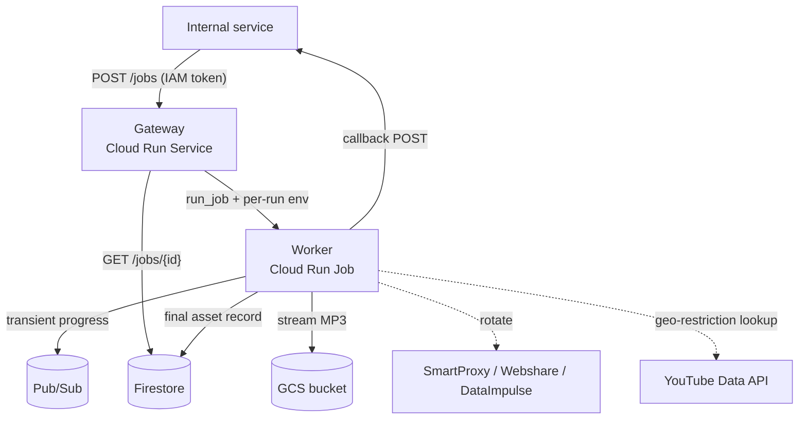

# High-Bandwidth-Proxies YouTube Downloader

A cloud-native service that downloads YouTube audio as MP3 through rotating
residential proxies, resolves geo-restrictions, and streams the result into
Google Cloud Storage — built to run on **Google Cloud Run**.

The system is split into two independently deployable services:

| Service | Cloud Run type | Role |
|---------|---------------|------|
| [`worker/`](worker) | **Job** | Data plane — downloads, transcodes, rotates proxies, streams to GCS, reports progress. |
| [`gateway/`](gateway) | **Service** (FastAPI) | Control plane — authenticates internal callers, validates requests, triggers the worker Job, exposes status. |

## Architecture



- **Control vs. data plane** — the gateway never downloads anything; the worker
  never exposes an HTTP API. Each has its own service account and lifecycle.
- **Decoupled visibility** — progress is transient (Pub/Sub only), final assets
  are persisted to Firestore and POSTed to the requester's `callback_url`. The
  worker stays stateless with respect to other projects' databases.
- **Stateless worker** — every run is parameterised by per-execution env vars
  (`JOB_ID`, `VIDEO_URLS`, `CALLBACK_URL`, `ORIGIN_ID`, …) injected at
  `jobs execute` time by the gateway.

## Repository layout

```
.
├── worker/                 # Cloud Run Job — see worker/README.md
│   ├── src/
│   │   ├── main.py             # env/CLI entry point
│   │   ├── config.py           # env-var configuration
│   │   ├── downloader.py       # yt-dlp + ffmpeg wrapper
│   │   ├── proxy_manager.py    # generic proxy pool
│   │   ├── providers/          # smartproxy | webshare | dataimpulse
│   │   ├── restrictions.py     # geo-restriction resolver
│   │   ├── youtube_client.py   # YouTube Data API client
│   │   └── storage/            # events, pubsub, firestore, callback, bucket
│   ├── Dockerfile
│   └── requirements.txt
├── gateway/                # Cloud Run Service — see gateway/README.md
│   ├── src/
│   │   ├── main.py             # FastAPI app (POST /jobs, GET /jobs/{id})
│   │   ├── config.py
│   │   ├── runner.py           # Cloud Run Admin run_job client
│   │   └── store.py            # read-only Firestore status lookups
│   ├── Dockerfile
│   └── requirements.txt
└── .github/workflows/
    ├── dev_executor_deploy.yaml   # builds & deploys the worker Job
    └── dev_gateway_deploy.yaml    # builds & deploys the gateway Service
```

## Proxy providers

Pluggable `ProxyProvider` implementations registered in
[`worker/src/providers`](worker/src/providers):

| Provider | `--provider` | Country targeting | Notes |
|----------|--------------|-------------------|-------|
| SmartProxy | `smartproxy` | yes (gateway username) | Also supports API-extraction lists. Used by the auto geo-resolver. |
| Webshare | `webshare` | no | Rotating gateway and/or API proxy list. |
| DataImpulse | `dataimpulse` | yes (gateway username) | Pay-as-you-go rotating gateway. |

## Request flow

1. An internal service calls `POST /jobs` on the gateway with a Cloud Run IAM
   identity token, supplying `urls`, `origin_id`, and an optional `callback_url`.
2. The gateway validates the payload, mints a `JOB_ID`, and starts the worker
   Job with per-run env overrides (fire-and-forget).
3. The worker resolves a viewable proxy country (if the video is geo-restricted),
   downloads + transcodes the audio, and **streams** it to
   `gs://<bucket>/<prefix>/<video_id>.mp3` with custom object metadata.
4. Progress is published to Pub/Sub; the final asset is written to Firestore and
   POSTed to `callback_url`.
5. Callers poll `GET /jobs/{id}` (reads Firestore) for status.

## Local development

Both services use [uv](https://docs.astral.sh/uv/). `ffmpeg` must be installed
for the worker.

```bash
# Worker — download a single video as MP3
cd worker
uv run python src/main.py "https://youtu.be/VIDEO_ID" \
  --provider smartproxy \
  --smartproxy-gateway gate.smartproxy.com:7000 \
  --smartproxy-username USER --smartproxy-password PASS

# Gateway — run the control-plane API
cd gateway
uv run uvicorn src.main:app --reload --port 8080
```

See [worker/README.md](worker/README.md) and [gateway/README.md](gateway/README.md)
for full options and the complete environment-variable reference.

## Deployment

Pushing to the `dev_executor_deploy` branch triggers the two workflows
independently (scoped by path):

- **Worker** — [dev_executor_deploy.yaml](.github/workflows/dev_executor_deploy.yaml)
  builds the image, provisions the Pub/Sub topic and result bucket, grants the
  runtime SA its IAM roles (`secretmanager.secretAccessor`, `pubsub.publisher`,
  `datastore.user`, bucket-scoped `storage.objectAdmin`), wires Secret Manager
  secrets, and creates/updates the Cloud Run Job.
- **Gateway** — [dev_gateway_deploy.yaml](.github/workflows/dev_gateway_deploy.yaml)
  builds the image, grants the gateway SA `run.developer` + `datastore.viewer`,
  and deploys an internal-ingress Cloud Run Service with
  `--no-allow-unauthenticated`.

Trigger a single download run directly against the worker:

```bash
gcloud run jobs execute lds-sc-audio-download-job --region us-central1 \
  --update-env-vars JOB_ID=abc123,ORIGIN_ID=project-a,\
CALLBACK_URL=https://project-a.example/api/jobs/abc123,\
VIDEO_URLS="https://youtu.be/VIDEO_ID"
```

## Configuration & secrets

All configuration is read from environment variables; secrets are injected from
**Google Secret Manager** at deploy time (`--set-secrets`), so credentials never
live in source.

| Concern | Where |
|---------|-------|
| Proxy credentials | `SMARTPROXY_*`, `WEBSHARE_*`, `DATAIMPULSE_*` (Secret Manager) |
| YouTube content-owner auth | `YOUTUBE_SA_JSON`, `YOUTUBE_CONTENT_OWNER_ID` (Secret Manager) |
| Visibility / storage | `PUBSUB_TOPIC`, `FIRESTORE_COLLECTION`, `RESULT_BUCKET`, `RESULT_PREFIX` |
| Per-run inputs | `JOB_ID`, `ORIGIN_ID`, `VIDEO_URLS`, `CALLBACK_URL` (set at execution) |

Required GitHub secrets: `GCP_PROJECT_ID_DEV`, `GCP_SA_KEY_DEV`,
`CLOUD_RUN_SA_DEV` (worker SA), `GATEWAY_SA_DEV` (gateway SA), and
`RESULT_BUCKET_DEV` (GCS bucket name).

## Authentication model

- **Gateway** is internal-only: deployed with `--ingress internal
  --no-allow-unauthenticated`. Callers present a Cloud Run IAM identity token;
  grant each caller SA `roles/run.invoker` on the gateway service. There are no
  application-level API keys.
- **Worker** uses its runtime SA (ADC) for Secret Manager, Firestore, Pub/Sub,
  and GCS. YouTube access uses a cross-project content-owner SA key
  (`YOUTUBE_SA_JSON`) because ADC cannot impersonate it.

## Tests

```bash
cd worker/src && uv run python test_request.py
```
